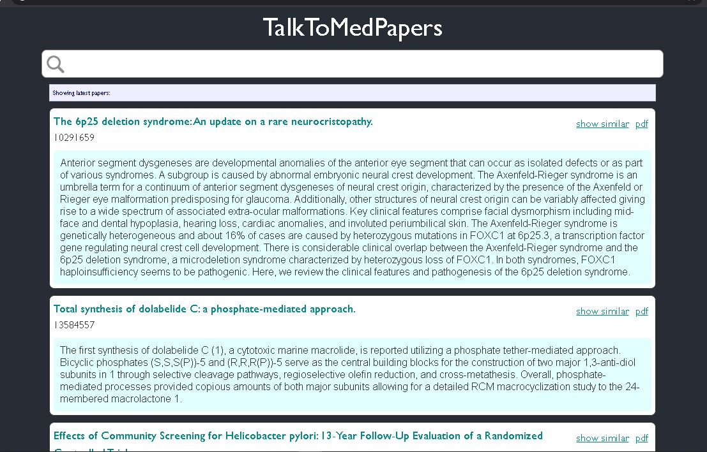

# MedSearch

MedSearch is a semantic search engine for medical scientific papers

- **Data**: 14 million papers from PubMed
- **Models**: TD-IDF, Clustering KMeans, BioBERT, SentenceTransformers, ScanNN, FAISS, Universal Sentence Encoders.
- Flask App, React.js 

